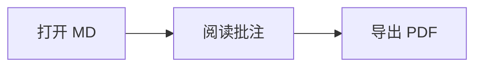

# MDTool 示例文档

欢迎使用 **MDTool** — 本地 Markdown 阅读器。

## 功能试用

### 文字选择与复制

选中下面任意文字，会弹出工具条，可**复制**或**高亮**：

> 阅读是一种与作者对话的方式。选区高亮会保存到同目录下的 `示例文档.md.mdtool.json` 文件中。

### 代码高亮

```typescript
interface Highlight {
  id: string
  color: string
  text: string
  anchor: {
    blockIndex: number
    startOffset: number
    endOffset: number
  }
}
```

### 表格

| 功能 | 快捷键 | 状态 |
|------|--------|------|
| 打开文件 | Ctrl+O | Phase 1 |
| 高亮 | Ctrl+H | Phase 1 |
| 复制 | 选区工具条 | Phase 1 |

### 列表

- 目录大纲自动从标题生成
- 阅读进度自动记忆
- 支持浅色 / 深色 / 跟随系统主题

### 数学公式

行内公式 $E = mc^2$，块级公式：

$$
\int_0^1 x^2 \, dx = \frac{1}{3}
$$

### Mermaid 图表



## 二级标题示例

滚动页面时，左侧目录会高亮当前章节。关闭应用后重新打开本文档，将恢复到上次阅读位置。

### 三级标题

尝试高亮本段文字，然后重启 MDTool 验证批注是否持久化。

---

*MDTool Phase 1 MVP*
